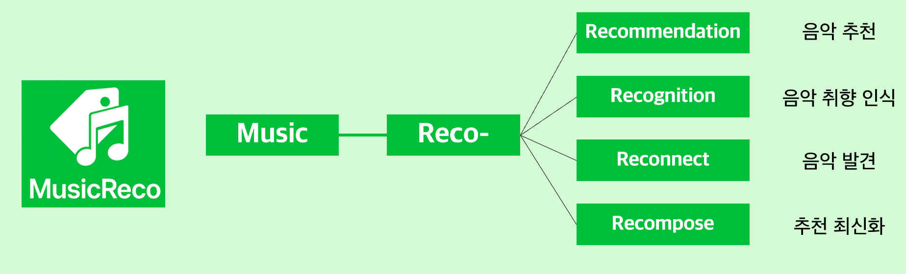
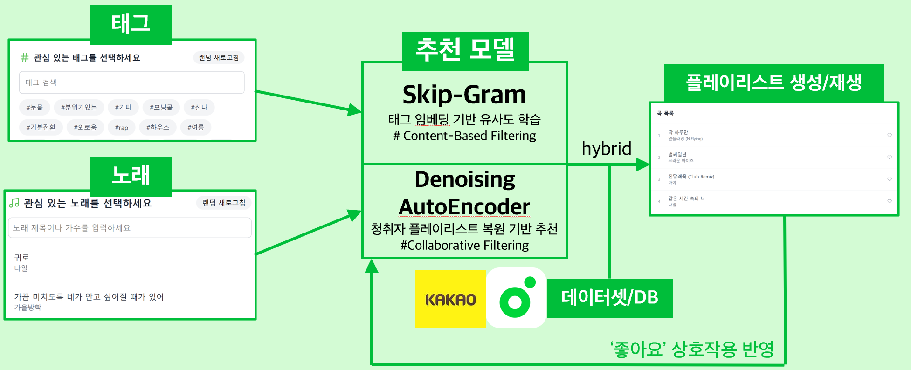

# 🎵 MUSIC RECOMMENDATION SYSTEM  
> **Deep Learning-based Multimodal Personalized Music Recommendation Project**

본 프로젝트는 사용자의 현재 기분과 감정을 태그로 입력받아 최적의 플레이리스트를 추천해주는 AI 음악 추천 시스템입니다.  

딥러닝 기반 **협업 필터링 (Denoising AutoEncoder)** 과 **콘텐츠 기반 필터링 (SGNS)** 을 결합한 하이브리드 모델을 중심으로,  
**FastAPI 백엔드**, **React 프론트엔드**, **PyTorch 추천 모델 서버**로 구성되어 있습니다.

---

## 📘 Project Overview

| 항목 | 내용 |
|------|------|
| **프로젝트명** | MusicReco (뮤직레코) |
| **주제** | 사용자 플레이리스트 기반 음악 추천 시스템 |
| **기간** | 2025.03 ~ 2025.12 |
| **개발 인원** | 김남호 · 이정재 |
| **데이터셋** | Kakao Melon Playlist Dataset (약 148,826개 플레이리스트, 649,091곡) |
| **핵심 목표** | 멀티모달 임베딩 기반 개인화 음악 추천 + 웹 시각화 구현 |

---
## What is Music-Reco?

  

---
## Structure
 

  

---
## ⚙️ Tech Stack

| 영역 | 내용 |
|------|------|
| **Frontend** | React · Vite · TypeScript · TailwindCSS · Lucide Icons |
| **Backend** | FastAPI · SQLite ·  FAISS (ANN Search) |
| **ML / Recommender** | PyTorch · NumPy · Scikit-learn |
| **Infra / Tools** | VSCode · Git · Kaggle · Colab |
| **Dataset** | Kakao Melon Playlist Dataset |

---
## 🧩 Part

### 🎨 1️⃣ Frontend

- 기술 스택: React + TypeScript + Vite + TailwindCSS  
- 주요 기능:
  - 사용자 로그인 / 회원가입
  - 태그 및 곡 선택 UI
  - 추천 결과 대시보드 (DAE / SGNS 기반)
  - My Playlist 관리, 좋아요, YouTube 미리듣기
- 구현:
  - 태그/노래 기반 검색, 랜덤 추천 인터페이스
  - 좋아요 상호작용 기반 유사곡 / 같이 많이 들은 노래 추천
  - 노래 클릭 시 Youtube iframe 기반 노래 재생

### ⚙️ 2️⃣ Backend

- 기술 스택: FastAPI + MySQL + SQLAlchemy + FAISS  
- 주요 기능:
  - RESTful API (회원 / 플레이리스트 / 추천)
  - SGNS & DAE 모델 호출 및 결과 반환
  - SQLite 기반 데이터 관리 및 로그 기록

### 🤖 3️⃣ Machine Learning 

- DAE (Denoising AutoEncoder)
    - 사용자 플레이리스트 복원 기반 Collaborative Filtering
    - 서빙: FastAPI 기반 엔드포인트 제공

- SGNS (Skip-Gram Negative Sampling)
    - 곡별 태그 임베딩 학습을 통한 Content-based Filtering
    - 곡 임베딩 공간에서 유사도 계산
    - 서빙: FastAPI 기반 엔드포인트 제공

---
## 👨‍💻 Authors

### MusicReco Team (Graduation Project)
김남호 — Denoising AutoEncoder Model development, ML Part Leader

이정재 — Skip-Gram Negative Sampling Model development, Web Application Development, Web Part Leader

